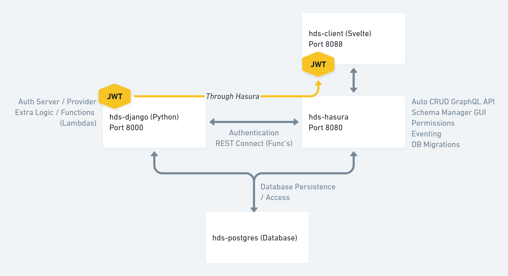

# Hasura + Django Starter (HDS)

A project starter which pairs up the best features of Hasura with Django ❤️

The best of Hasura's instant, realtime GraphQL API meshed with Django's built-in auth model and the ability to extend logic across the two services.

### Hasura
- Auto-generate GraphQL API for any Postgres database.
- Database management UI.
- Permissions management system (based on Postgres row-level permissions).
- Events (with sample events for sending registration and forgot password emails triggers from Hasura to Django).
- Action (with a sample action for demo-ing more advanced non-CRUD logic between Hasura and Django).
- Database / metadata migrations (and container auto-apply).

### Django
- Registration, login, and password reset auth-flows (REST-based).
- JWT tokens (Simple-JWT), with custom Hasura claims by way of Django's built-in auth-layer.
- Extended user model (added role, registration, UUID, registration_sent > flag for new user emails).
- Ability to extend Hasura's logic through endpoints (+ getting auth-only endpoints for **free**).

## Get Started
Running these 3 commands will get your project up and running (as long as you have Docker installed).
For Docker installation - see here: https://docs.docker.com/get-docker/

```
git clone https://github.com/mrtnmark/hasura-django-starter.git && cd ./hasura-django-starter && docker-compose up
```

***Already cloned the repo?*** Just run `docker-compose up` from the project directory.

Afterwards:
- Your Hasura Console dashboard will be exposed at: http://localhost:8080/console
- You can start creating / exposing tables to your API here: http://localhost:8080/console/data/schema/public
- You can test with your GraphQL endpoint here: http://localhost:8080/v1/graphql

## Client (Frontend) Startup
## Svelte
[ToDo] Write client docs.

From the project directory:
```
docker-compose -f docker-compose.yml -f docker-compose-client-svelte.yml up
```

-----

## Project Layout


## Hasura Directory Layout
    ./hasura/metadata/

Contains YAML files for all the metadata that runs Hasura. Includes things like tables which are exposed and configuration options for events.

    ./hasura/migrations/

Contains folders with SQL files. These will be used to migrate your database. There should be `up.sql` and `down.sql` files in each directory - these are meant for apply migrations and rollbacks.

The container we're using will automatically pick this up and apply them on building the container. If you don't want to use these, use the other image commented out in the `docker-compose.yml` file.

## Django Directory Layout

    ./django/app/

Contains our project settings > contains `settings.py`. The `urls.py` for the root of our project direct us to the `api` application.

    ./django/api/

Contains all of our application logic:

- admin.py
    - What shows up in the Django admin interface (currently disabled, but configured to show any custom info for users)
- apps.py
    - General configuration options
- models.py
    - Extends user model
    - Adds `user`, `role` (for custom roles), `registration_sent` (flag for registration email), `uuid` as a lookup to default user model.
- auth.py
    - Auth specific views and serializers.
    - Customizes Hasura JWT claims.
- logic.py
    - Contains any extended logic (this is where you can write custom functions).
    - This is used below for our email eventing examples, and a custom action example where Hasura -> <- from Django.
- urls.py
    - Routing for API endpoints

## Changing Secrets
- **You should update your secrets and passwords**, everything in this demo is for demonstration purposes.
- You should be able to update everything by using the `docker-compose.yml` to configure your new secret key.
- If updating the admin password for Hasura, you'll also need to update the `./hasura/config.yaml` in order to use the **Creating New Migrations** section below.

If you're running your Django container and would like to generate a new secret, you can do so by using the following command:

    docker exec hds-django bash -c 'python -c "import secrets; print(secrets.token_urlsafe())"'

***Note**: if you're using a `$` as a character, you need to use `$$` for docker-compose to interpolate it as `$`*.

More information here: https://stackoverflow.com/questions/40619582/how-can-i-escape-a-dollar-sign-in-a-docker-compose-file

## Django Auth Endpoints
    http://localhost:8000/api/user/register/

`POST` : accepts `username`, `email`, and `password`. Returns new user info and a first set of returned tokens.

    http://localhost:8000/api/token/

`POST` : accepts `username` and `password`. Returns access and refresh tokens.

    http://localhost:8000/api/token/refresh/

`POST` : accepts `refresh` token. Provides new access token.

    http://localhost:8000/api/token/verify/

`POST` : accepts either `token`. Returns 200 status if the token is verified.

    http://localhost:8000/api/user/change_password/

`PUT` / `PATCH` : accepts `old_password`, `new_password`. Requires `authorization` header with access token.

    http://localhost:8000/api/user/reset_password/

`POST` : accepts `email`. Generates a password reset token in the database 

*Note: there's a message below in **Events** in where you can add your SMTP email logic logic.*

    http://localhost:8000/api/user/reset_password/

`POST` : accepts `old_password`, `new_password`. Requires `authorization` header with access token.

    http://localhost:8000/api/user/reset_password/validate/

`POST` : accepts `email` and `token`. Returns 200 status if the token is verified.

    http://localhost:8000/api/user/reset_password/confirm/

`POST` : accepts `email`, `token`, `password` (new password). Returns 200 status if the token + email pair is verified and the password is updated.

## Want to test these endpoints pre-development?
From the project directory:
```
docker-compose -f docker-compose.yml -f docker-compose-hoppscotch.yml up
```

In `docker-compose.yml` if you uncomment the `Hoppscotch` service it will serve a request builder at http://localhost:3000.

I would also recommend Postman (paid) or Insomnia (OSS).


-----

## Using Hasura + Django to Handle Advanced Logic
This project makes use of 2 of Hasura's methods for extending it's generate CRUD API.

### Events
- Events use database eventing to provide *at least once* delivery of a database event (create, update, etc.) to a webhook endpoint.
- We have 2 custom events created at `http://localhost:8080/console/events/data/manage` for sending emails to newly registered users and new password resets.
    - These events throw to endpoints which are defined at `./django/api/logic.py` (+ `./django/api/urls.py`).
    - You'll notice each of these items have a flag to define completion (`registration_sent`, and `reset_sent` in their respective tables) - that's because of the at least once caveat to make sure that in the case of a double-send (rare, but happens), we don't accidentally double-send an email.

### Actions
- Actions extend the query or mutation root of the generated API to define a payload which will be sent to a webhook endpoint, and an expected response to get back.
- We have 1 action created at `http://localhost:8080/console/actions/manage/actions` which is a very simple example.
    - The payload is a food which will be thrown to the logic defined in `./django/api/logic.py` (+ `./django/api/urls.py`).
    - The logic looks at if the food entered is a hotdog and replies *true* of *false*.
    - The nice part of this we can lean on Django's built in `@permission_classes([IsAuthenticated])` decorator in `logic.py` to verify I'm a logged in user making the request (we're passing our headers from the action), and pair that with Hasura's permissions around which role should be able to make the request through GraphQL.

## Setting Up Emails (and the Reset Password Flow)
We have some sample email logic which can be found in `./django/api/logic.py` which can be uncommented and used as needed.

For the reset password flow, generally you'll be looking to handle the token as:
- Embed token in URL link in email (boilerplate shows one implementation of how you may want to do this).
- In that URL, pass token as query-string which the client can use.
- Client will call back to the `/api/reset_password/confirm/` endpoint with the user's token, email, and new password to reset the password.

## Using Hasura's Permission Management
You can customize permissions logic based on the `Permission` tab of any table in the schema builder / explorer http://localhost:8080/console/data/schema/public

If you create a role for `public` this role will be able to access without authorization - so you can do things like give it read status to public-facing parts of the application.

The role name `public` is defined in the `docker-compose.yml` file under `HASURA_GRAPHQL_UNAUTHORIZED_ROLE`.

There is a sample public table we've created with permissions at: http://localhost:8080/console/data/schema/public/tables/public_posts/permissions

To test out your permission you can use it as a `x-hasura-role` header in your API explorer (as pictured below): http://localhost:8080/console/api-explorer


If you'd like to remove the sample migration which creates an initial the public posts table, a test user, and a post - you can do so by removing the directory: 
    ./hasura/migrations/1609171942629_create_public_demo_table/
    
## Creating New Migrations

Start by installing the Hasura CLI (https://hasura.io/docs/1.0/graphql/core/hasura-cli/install-hasura-cli.html):

    curl -L https://github.com/hasura/graphql-engine/raw/stable/cli/get.sh | bash

- Change directory to Hasura in this project

    `cd ./hasura`

- Bring up the Hasura CLI Console
    
    `hasura console`

- Console should launch on http://localhost:9695

Any schema oriented changes should create new migrations within the `./hasura/migrations` directory.

These migrations are saved as SQL files. For each migration created there will be an **up.sql** and **down.sql**. These are made for applying the migration (up), and then rolling back the migration (down) if needed.

When you're ready to export your metadata (all tracked tables, actions, events, etc.) you're able to do so by running `hasura metadata export`.

This will export your metadata information as YAML files to your `./hasura/metadata` directory.

For more information on all the features of migrations - read the CLI docs over at: https://hasura.io/docs/1.0/graphql/core/hasura-cli/index.html